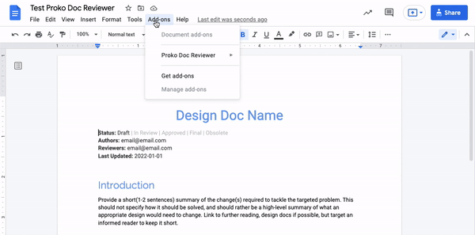

## Overview


Proko Doc Reviewer is a Google Doc add-on that helps you manage reviewers and approvers of a Google Doc. 

## Reviewers / Approvers
The table below is a recommended role assignment, definitions of Approvers / Reviewers
should be determined among all stakeholders before working on the desing doc.

| Roles      | Description | Responsibility                                  |
|------------|-------------|-------------------------------------------------|
| Approver   | A person whose approval may affect the overall design of the product, this role is being considered as HIGH stakeholder. An Approver's approval is **required** | Add comments and reviews, approve the document. |
| Reviewer | A person whose approval might have minor effect to the overall design of the product, this role is being considered as MEDIUM to LOW stakeholder. A Reviewer's approval is **optional** | Add comments/feedbcks to the document, review the document |

## Author Instructions:
This section describes how to install/use Proko Doc Reviewer.

### 1. Install add-on
1. Click [Link](https://workspace.google.com/marketplace/app/proko_doc_reviewer/1029864673452).
2. Click install.
3. When asked to allow permission to your doc and drive, click *Allow*.

### 2. Verify Table is Installed
Verify the initial table is shown in your doc. <br> <br>
 <br> <br>
If you do not see the table, go to *Add-ons -> Proko Doc Reviewer -> Update Status*. <br> <br>


### 3a. Add Approver
You can add as many approvers as you like, but each must have a separated action item.

To add an approver whose username is foo@prokopark.us:
1. Add an action item anywhere (except inside the table / recommended to be on the title of the document) with the following text:
   1. ```
      @foo@prokopark.us
      
      #approver
      
      Hi Foo:
      Please review and approver this document, when you resolve this action item, Proko Doc Reviewer
      will automatically mark the status as approved by you.
      
      Thanks!
      ```
      **NOTE:** The Hi Foo...  and the message is optional, you can modify it per your preference.
   <details>
       <summary>Example Screenshot:</summary>
       </img>
   </details>
2. Check the `Assign to foo@prokopark.us` checkbox before adding the action item.
3. Click Update Status in *Add-ons -> Proko Doc Reviewer -> Update Status*.
4. The new approver should show up in the table.
   <details>
       <summary>Example Screenshot:</summary>
       </img>
   </details>

### 3b. Add Reviewer
The steps are the same as adding an approver, but change Step 1:
1. Add an action item anywhere (except inside the table / recommended to be on the title of the document) with the following text:
   1. ```
      @foo@prokopark.us
      
      #reviewer
      
      Hi Foo:
      Please review this document, when you resolve this action item, Proko Doc Reviewer
      will automatically mark the status as reviewed by you.
      
      Thanks!
      ```
      **NOTE:** The Hi Foo...  and the message is optional, you can modify it per your preference.
   <details>
       <summary>Example Screenshot:</summary>
       </img>
   </details>

## Approver & Reviewer Instructions:
As an approver or reviewer, your status is displayed in the table like the following screenshot:


With our add-on, approvers can change their status from `PENDING` to `APPROVED`, reviewers can change
their status from `PENDING` to `REVIEWED`.

### Approve / Review a doc
To change your status from `PENDING` to `APPROVED` as an approver, or `PENDING` to `REVIEWED` as a reviewer:
1. In the doc you are reviewing / approving, fnd the open action item assigned to youthat contains `#approver` or `#reviewer` tag alone a lne.
2. Resolve the action item.
3. Wait a day for the table to auto-update, or click Update Status in *Add-ons -> Proko Doc Reviewer -> Update Status*.


### Undo an Approval or Review
To change your status back to `PENDING`:
1. In the doc ou are reviewing or approving, find the resolved action item assigned to you that contains `#approver` or `reviewer` alone on a line.
2. Re-open the action item.

## Further Questions:
For any further questions, feel free to contact [doc-reviewer-engs@prokopark.us](doc-reviewer-engs@prokopark.us).
